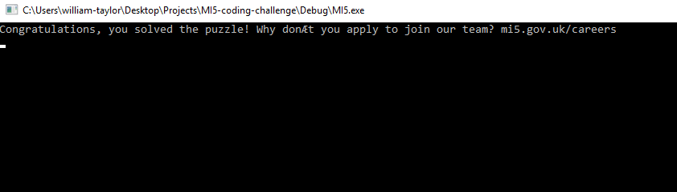

# MI5 Challenge &nbsp; [  

I was looking at various coding challenges online and found this which interested me. The repository just houses the code that outputs the hidden message. Nothing too complicated but I am quite happy I solved the puzzle and hey it was fun! This program was written in C++ and uses FreeImage an image loading library. It was all that was needed as all the challenged needed was the ability to parse an image file.

**Warning do not read on if you want the solution spoiled!**

## Solution 

Given this image the challenge tells you to find a hidden message. As its size isn’t even and because each row has long sections of the same colour we can assume the message isn’t hidden with each colour representing a one or a zero. So I just counted how many times the next pixel was the same colour in the image. If you treat each number as a ASCII character and print all the values, you realise it’s a list of hexadecimal values separated by a hyphen. Once these hyphens are stripped out and each hexadecimal value is properly converted to a character you get the hidden message. Which is the following.

